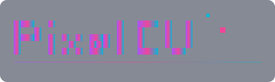

<p align="center">
  
</p>

# PixelCV Starter (Local)

> 🚀 Plataforma moderna para crear, compartir y gamificar CVs con RenderCV e Inteligencia Artificial Local (Ollama).


## ✨ Características

- 📄 **CVs Profesionales**: Integración con RenderCV para generar PDFs perfectos.
- 🤖 **IA Avanzada (Contextual)**: 
  - **Mejora Inteligente**: Botones ✨ integrados para optimizar logros, habilidades y resumen.
  - **Revisión Interactiva**: Compara sugerencias de IA lado a lado antes de aplicarlas.
  - **Instrucciones Personalizadas**: Guía a la IA (ej: "Hazlo más corto", "Usa tono ejecutivo").
  - **Análisis Integral**: Reporte detallado de fortalezas y debilidades de tu perfil con Markdown renderizado.
  - **Soporte Múltiples Modelos**: Compatible con modelos de Ollama (phi3.5, llama3, mistral, etc.).
- 🎨 **Diseño Retro/Gamer Único**: 
  - **Login**: Tema verde ("Player Login") con efectos CRT y bordes pixel art.
  - **Dashboard**: Tema cyan/azul ("Player Stats") con animaciones flotantes.
  - **Editor & Wizard**: Tema morado/rosa ("Game Editor") con estética gamer.
  - **Home**: Tema morado con glitch text y sección "How it Works".
- 🌐 **Landing Pages**: Publica tu CV como página web personalizada con slug único.
- 🎮 **Gamificación**: Gana puntos, sube de nivel y desbloquea badges por tu actividad.
- 🏆 **Comunidad**: Explora, comenta y dale "like" a CVs de otros profesionales.

## 🎯 Inicio Rápido

```bash
# 1. Clonar e instalar
git clone https://github.com/bladealex9848/pixelcv_starter_local.git
cd pixelcv_starter_local
./INSTALL.sh

# 2. Iniciar (Limpia cache y arranca servicios)
./run.sh

# 3. Abrir en navegador
# Frontend: http://localhost:3000
# Diagnostic Suite: docs/test-interactivo.html
```

## 🏗️ Arquitectura Reorganizada

```
├── assets/           # Recursos visuales y logos
├── backend/          # FastAPI (Python) + Ollama Service
│   ├── app/api/      # Endpoints: auth, cv, community, ollama, gamification
│   ├── app/models/   # DB: User, CV, Comments, PointHistory...
│   └── app/services/ # IA, YAML builder, RenderCV integration
├── frontend/         # Next.js 14 (TypeScript) + Tailwind
│   ├── app/          # Dashboard, Editor, Community, Leaderboard
│   ├── components/   # CVWizard, AIReviewModal, MarkdownModal
│   └── public/themes/ # Vistas previas de temas RenderCV
└── docs/             # DOCUMENTACIÓN ORGANIZADA
    ├── installation/ # Guías de configuración y Ollama
    ├── development/  # Arquitectura, planes y estado del proyecto
    └── scripts/      # Scripts de prueba y utilidades
```

## 🎮 Gamificación

### Puntos por Acción
- **Crear CV**: +10 pts | **Publicar**: +50 pts
- **Recibir visita**: +5 pts | **Like (Dar/Recibir)**: +2/+20 pts
- **Comentar**: +15 pts | **Badge**: +100 pts

### Niveles
🌱 Novato → 🌿 Aprendiz → 🌳 Maestro → 🏔️ Experto → 👑 **Leyenda**

## 🤖 Configuración de IA (Ollama)

### Modelos Soportados
El sistema es compatible con cualquier modelo de Ollama. Los más recomendados para este proyecto:

- **phi3.5:latest** (Principal) - Modelo ligero y eficiente, ideal para tareas de mejora de texto y revisión de CVs.
- **llama3:latest** - Modelo más robusto para análisis complejos.
- **mistral:latest** - Alternativa eficiente para español.
- **qwen2:latest** - Excelente para tareas técnicas.

### Instalación de Modelos
```bash
# Modelo principal recomendado
ollama pull phi3.5:latest

# Alternativas opcionales
ollama pull llama3:latest
ollama pull mistral:latest
```

El sistema detecta automáticamente los modelos disponibles en tu instalación de Ollama.

## 📖 Documentación

La documentación se ha estructurado para facilitar la navegación:
- [**Índice de Documentación**](docs/INDEX.md)
- [Guía de Instalación](docs/installation/usage_guide.md)
- [Configuración de Ollama (IA)](docs/installation/ollama_setup.md)
- [Suite de Diagnóstico](docs/test-interactivo.html) (Herramienta web de prueba)

## 🛠️ Tecnologías

- **Backend**: FastAPI, SQLAlchemy, SQLite, JWT, RenderCV.
- **Frontend**: Next.js 14, TypeScript, Tailwind CSS, Lucide Icons, react-markdown, remark-gfm, @tailwindcss/typography.
- **IA**: Ollama (phi3.5 / llama3 / mistral), Pydantic validation.
- **Estilos**: Tailwind CSS con animaciones personalizadas (twinkle, float, glow, scanline, glitch, pixel-border).

## 📝 Scripts Principales

```bash
./run.sh           # Inicia backend y frontend (recomendado)
./INSTALL.sh       # Instalación inicial de dependencias
./commit-simple.sh # Utilidad para commits rápidos
```

---
**Hecho con ❤️, Píxeles y mucha Inteligencia Artificial**