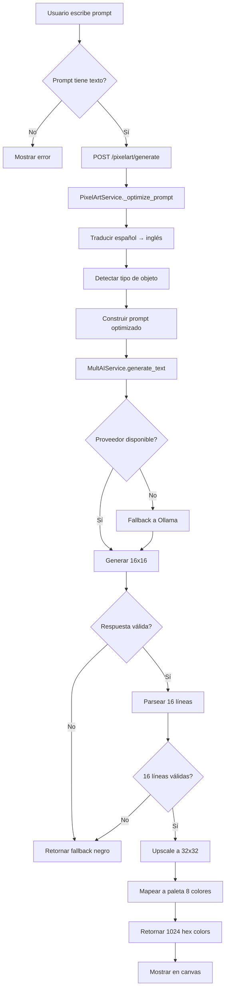
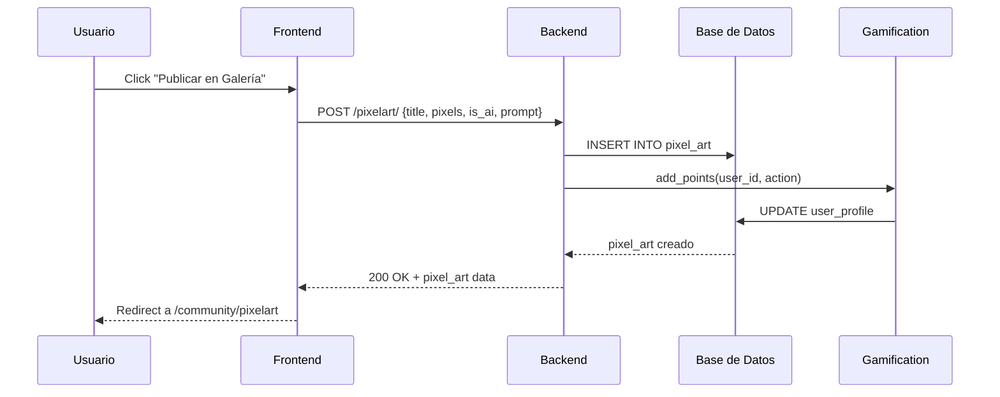

# PixelArt: Generación Dinámica de OG Images y Mejoras del Sistema

> **For Claude:** REQUIRED SUB-SKILL: Use superpowers:executing-plans to implement this plan task-by-task.

**Goal:** Implementar generación dinámica de OG images para pixelart y mejorar el sistema de creación con IA

**Architecture:**
- Backend FastAPI genera imágenes OG dinámicas usando Canvas y Sharp al crear pixelart
- Next.js API route (`/api/og/pixelart/[id]`) genera imágenes PNG on-demand
- Sistema mejorado de prompts con plantillas y ejemplos visuales
- Editor manual mejorado con más herramientas y exportaciones

**Tech Stack:** FastAPI, Canvas (Python), Sharp/Node.js, Next.js API Routes, ImageMagick, OpenAI API

---

## Parte 1: Documentación del Método Actual de OG Images

### Task 1: Documentar creación de og-image.png actual

**Files:**
- Modify: `/root/pixelcv/docs/IMPLEMENTACION-METADATA-SOCIAL-MULTI-DOMINIO-2026-01-08.md`
- Create: `/root/pixelcv/docs/CREACION-OG-IMAGES-METODO-2026-01-08.md`

**Step 1: Agregar documentación del método ImageMagick al README existente**

En `/root/pixelcv/docs/IMPLEMENTACION-METADATA-SOCIAL-MULTI-DOMINIO-2026-01-08.md`, agregar después de la línea del método actual:

```markdown
### Método de Creación Actual (ImageMagick)

**Comando usado:**
```bash
cd /root/pixelcv/frontend/public
convert -size 1200x630 gradient:#14b8a6-#059669 -gravity center -pointsize 80 -fill white -font DejaVu-Sans-Bold -annotate +0-0 "PixelCV" -pointsize 40 -annotate +0+80 "Crea CVs Profesionales con IA" og-image.png
```

**Desglose del comando:**
- `-size 1200x630`: Dimensiones estándar para Facebook/LinkedIn
- `gradient:#14b8a6-#059669`: Gradiente teal/emerald (colores de marca)
- `-gravity center`: Centrar contenido
- `-pointsize 80`: Tamaño de texto principal
- `-fill white`: Color del texto
- `-font DejaVu-Sans-Bold`: Fuente (puede variar según sistema)
- `-annotate +0-0 "PixelCV"`: Título centrado
- `-pointsize 40 -annotate +0+80 "..."`: Subtítulo 80px abajo

**Limitaciones del método actual:**
- Imagen estática, no muestra el pixelart real
- No personalizable por usuario
- No refleja el contenido dinámico de la plataforma
```

**Step 2: Crear documento standalone con métodos alternativos**

Crear archivo `/root/pixelcv/docs/CREACION-OG-IMAGES-METODO-2026-01-08.md`:

```markdown
# Métodos de Creación de OG Images para PixelCV

Fecha: 2026-01-08

## Método 1: ImageMagick (Actual)

### Comando Básico
```bash
cd /root/pixelcv/frontend/public
convert -size 1200x630 gradient:#14b8a6-#059669 -gravity center -pointsize 80 -fill white -font DejaVu-Sans-Bold -annotate +0-0 "PixelCV" -pointsize 40 -annotate +0+80 "Crea CVs Profesionales con IA" og-image.png
```

### Con Bordes y Decoraciones
```bash
convert -size 1200x630 xc:none -fill gradient:#14b8a6-#059669 -draw rectangle 0,0,1200,630 \
  -gravity center -pointsize 80 -fill white -font DejaVu-Sans-Bold -annotate +0-0 "PixelCV" \
  -pointsize 40 -annotate +0+80 "Crea CVs Profesionales con IA" \
  -stroke white -strokewidth 4 -draw rectangle 50,50,1150,580 \
  og-image.png
```

### Verificar Imagen Creada
```bash
file og-image.png
identify og-image.png
```

## Método 2: Python + Pillow (Backend)

### Script de Generación
```python
from PIL import Image, ImageDraw, ImageFont
import os

def create_og_image(title: str, subtitle: str, output_path: str):
    """Genera OG image de 1200x630px"""
    img = Image.new('RGB', (1200, 630), color='#14b8a6')
    draw = ImageDraw.Draw(img)

    # Gradiente simple (simulado con rectángulos)
    for y in range(630):
        color = y / 630
        r = int(20 + color * (5 - 20))
        g = int(184 + color * (149 - 184))
        b = int(166 + color * (105 - 166))
        draw.rectangle([(0, y), (1200, y+1)], fill=(r, g, b))

    # Texto
    try:
        title_font = ImageFont.truetype("/usr/share/fonts/truetype/dejavu/DejaVuSans-Bold.ttf", 80)
        subtitle_font = ImageFont.truetype("/usr/share/fonts/truetype/dejavu/DejaVuSans.ttf", 40)
    except:
        title_font = ImageFont.load_default()
        subtitle_font = ImageFont.load_default()

    # Título centrado
    title_bbox = draw.textbbox((0, 0), title, font=title_font)
    title_width = title_bbox[2] - title_bbox[0]
    title_x = (1200 - title_width) // 2
    draw.text((title_x, 250), title, fill='white', font=title_font)

    # Subtítulo
    subtitle_bbox = draw.textbbox((0, 0), subtitle, font=subtitle_font)
    subtitle_width = subtitle_bbox[2] - subtitle_bbox[0]
    subtitle_x = (1200 - subtitle_width) // 2
    draw.text((subtitle_x, 350), subtitle, fill='white', font=subtitle_font)

    img.save(output_path)
    return output_path
```

## Método 3: Node.js + Canvas (API Route Dinámica)

### Instalación de Dependencias
```bash
npm install canvas @types/canvas
```

### API Route para Generación Dinámica
```typescript
// app/api/og/generate/route.ts
import { NextRequest, NextResponse } from 'next/server';
import createCanvas from 'canvas';

export async function GET(req: NextRequest) {
  const { searchParams } = new URL(req.url);
  const title = searchParams.get('title') || 'PixelCV';
  const subtitle = searchParams.get('subtitle') || 'Crea CVs Profesionales';

  const canvas = createCanvas(1200, 630);
  const ctx = canvas.getContext('2d');

  // Gradiente
  const gradient = ctx.createLinearGradient(0, 0, 0, 630);
  gradient.addColorStop(0, '#14b8a6');
  gradient.addColorStop(1, '#059669');
  ctx.fillStyle = gradient;
  ctx.fillRect(0, 0, 1200, 630);

  // Texto
  ctx.fillStyle = 'white';
  ctx.font = 'bold 80px sans-serif';
  ctx.textAlign = 'center';
  ctx.fillText(title, 600, 300);

  ctx.font = '40px sans-serif';
  ctx.fillText(subtitle, 600, 380);

  const buffer = canvas.toBuffer('image/png');

  return new NextResponse(buffer, {
    headers: {
      'Content-Type': 'image/png',
      'Cache-Control': 'public, max-age=31536000, immutable'
    }
  });
}
```

## Recomendación

Para PixelCV, usar **Método 3 (Node.js Canvas)** para generación dinámica de OG images que muestren el pixelart real cuando se comparte en redes sociales.
```

**Step 3: Commit documentación**

```bash
cd /root/pixelcv
git add docs/CREACION-OG-IMAGES-METODO-2026-01-08.md docs/IMPLEMENTACION-METADATA-SOCIAL-MULTI-DOMINIO-2026-01-08.md
git commit -m "docs: add OG image creation methods documentation"
```

---

## Parte 2: Sistema de Documentación del PixelArt Actual

### Task 2: Documentar arquitectura del sistema PixelArt

**Files:**
- Create: `/root/pixelcv/docs/SISTEMA-PIXELART-COMPLETO-2026-01-08.md`
- Create: `/root/pixelcv/docs/DIAGRAMA-FLUJO-PIXELART-2026-01-08.md`

**Step 1: Crear documentación completa del sistema**

Crear archivo `/root/pixelcv/docs/SISTEMA-PIXELART-COMPLETO-2026-01-08.md`:

```markdown
# Sistema PixelArt Completo - Documentación Técnica

**Fecha**: 2026-01-08
**Versión**: 1.0

## Arquitectura General

```
┌─────────────────────────────────────────────────────────────┐
│                     Frontend Next.js                        │
│  /community/pixelart/        → Galería de obras            │
│  /community/pixelart/create  → Editor de creación          │
│  components/PixelartEditor   → Canvas 32x32 interactivo    │
│  components/PixelartGallery → Grid con likes/comentarios    │
└─────────────────────────────────────────────────────────────┘
                              │
                              ▼
┌─────────────────────────────────────────────────────────────┐
│                    Backend FastAPI                         │
│  /pixelart/POST                → Crear obra                  │
│  /pixelart/GET                 → Galería paginada           │
│  /pixelart/generatePOST        → Generación IA             │
│  /pixelart/{id}/likePOST       → Sistema de likes           │
│  /pixelart/{id}/commentPOST    → Comentarios                │
└─────────────────────────────────────────────────────────────┘
                              │
                              ▼
┌─────────────────────────────────────────────────────────────┐
│                  Servicios de Capa Lógica                    │
│  pixelart_service.py           → Lógica de negocio          │
│  multi_ai_service.py           → Generación IA multi-prov   │
│  gamification_service.py       → Puntos y niveles           │
└─────────────────────────────────────────────────────────────┘
                              │
                              ▼
┌─────────────────────────────────────────────────────────────┐
│                     Base de Datos SQLite                    │
│  pixel_art                     → Obras (1024 píxeles)        │
│  pixel_art_likes              → Likes                      │
│  pixel_art_comments           → Comentarios                 │
└─────────────────────────────────────────────────────────────┘
```

## Modelo de Datos

### Tabla pixel_art
```python
class PixelArt(Base):
    id = Column(String, primary_key=True)           # UUID
    user_id = Column(String, ForeignKey("users.id"))
    title = Column(String, nullable=False)
    description = Column(Text)
    pixels_json = Column(JSON, nullable=False)      # Array[1024] hex colors
    width = Column(Integer, default=32)
    height = Column(Integer, default=32)
    prompt = Column(Text)                           # Prompt original si IA
    is_ai_generated = Column(Boolean, default=False)
    is_published = Column(Boolean, default=True)
    total_likes = Column(Integer, default=0)
    total_comments = Column(Integer, default=0)
    use_count = Column(Integer, default=0)          # Veces usado como avatar
    created_at = Column(DateTime, default=datetime.utcnow)
```

## Flujo de Creación

### 1. Creación Manual
```
Usuario → Editor 32x32 → Selecciona colores → Dibuja click por click
    ↓
Publicar → POST /pixelart/ → Guarda en BD → +10 puntos
```

### 2. Generación con IA
```
Usuario → Escribe prompt "Paisaje con casa y río" → Click "Generar con IA"
    ↓
POST /pixelart/generate → Optimiza prompt → Traduce a inglés
    ↓
Llama Multi-AI Service → Prueba ZAI/MiniMax → Si falla: Gemini/Claude
    ↓
Respuesta 16x16 (dígitos 0-7) → Upscale a 32x32 → Mapea a paleta 8 colores
    ↓
Usuario puede editar → Publicar → +50 puntos
```

## Paleta de Colores

| Dígito | Hex      | Uso                          |
|--------|----------|------------------------------|
| 0      | #000000  | Fondo / Transparente          |
| 1      | #FFDAB9  | Piel / Tono humano            |
| 2      | #4682B4  | Ropa / Azul acero             |
| 3      | #FFFFFF  | Brillos / Blanco             |
| 4      | #8B4513  | Cabello / Marrón              |
| 5      | #708090  | Metal / Gris                  |
| 6      | #FF4500  | Naranja vibrante             |
| 7      | #2F4F4F  | Sombras / Gris oscuro         |

## Gamificación

| Acción                    | Puntos | Evento                  |
|---------------------------|--------|-------------------------|
| Crear pixelart manual     | +10    | pixelart_created        |
| Generar con IA           | +50    | pixelart_ai_generated   |
| Recibir like             | +20    | pixelart_like_received  |
| Recibir comentario       | +15    | pixelart_comment_received|
```

## Problemas Conocidos y Limitaciones

1. **Generación IA no siempre coincide con el prompt**
   - El modelo puede no generar exactamente lo pedido
   - Necesita múltiples intentos para obtener resultado deseado
   - La paleta limitada de 8 colores reduce detalle

2. **Sin vista previa antes de publicar**
   - El usuario debe confiar en el resultado de IA
   - No puede regenerar sin perder el progreso

3. **Herramientas de edición limitadas**
   - Solo selector de color básico
   - Sin herramienta de pincel, goma, relleno
   - Sin deshacer/rehacer

4. **Sin exportación**
   - No se puede descargar como PNG
   - No se puede generar favicon
   - No se puede compartir directamente en redes sociales
```

**Step 2: Crear diagrama de flujo visual**

Crear archivo `/root/pixelcv/docs/DIAGRAMA-FLUJO-PIXELART-2026-01-08.md` con diagramas en Mermaid:

```markdown
# Diagramas de Flujo - Sistema PixelArt

## Diagrama 1: Generación con IA



## Diagrama 2: Guardado en Base de Datos


```

**Step 3: Commit documentación**

```bash
cd /root/pixelcv
git add docs/SISTEMA-PIXELART-COMPLETO-2026-01-08.md docs/DIAGRAMA-FLUJO-PIXELART-2026-01-08.md
git commit -m "docs: add complete pixelart system documentation and flow diagrams"
```

---

## Parte 3: Generación Dinámica de OG Images para PixelArt

### Task 3: Backend - Generar imagen al crear pixelart

**Files:**
- Create: `/root/pixelcv/backend/app/services/og_image_service.py`
- Modify: `/root/pixelcv/backend/app/services/pixelart_service.py`

**Step 1: Crear servicio de generación de OG images**

Crear archivo `/root/pixelcv/backend/app/services/og_image_service.py`:

```python
# -*- coding: utf-8 -*-
"""Servicio para generar OG images dinámicas de PixelArt"""
from PIL import Image, ImageDraw, ImageFont
import io
from typing import List
import os

class OGImageService:
    PALETTE = {
        "#000000": (0, 0, 0),
        "#FFDAB9": (255, 218, 185),
        "#4682B4": (70, 130, 180),
        "#FFFFFF": (255, 255, 255),
        "#8B4513": (139, 69, 19),
        "#708090": (112, 128, 144),
        "#FF4500": (255, 69, 0),
        "#2F4F4F": (47, 79, 79)
    }

    GRADIENT_START = (20, 184, 166)   # #14b8a6 teal
    GRADIENT_END = (5, 149, 105)     # #059669 emerald

    @staticmethod
    def _create_gradient(height: int, width: int) -> Image:
        """Crea imagen con gradiente vertical"""
        img = Image.new('RGB', (width, height))
        pixels = img.load()

        for y in range(height):
            ratio = y / height
            r = int(OGImageService.GRADIENT_START[0] * (1 - ratio) + OGImageService.GRADIENT_END[0] * ratio)
            g = int(OGImageService.GRADIENT_START[1] * (1 - ratio) + OGImageService.GRADIENT_END[1] * ratio)
            b = int(OGImageService.GRADIENT_START[2] * (1 - ratio) + OGImageService.GRADIENT_END[2] * ratio)

            for x in range(width):
                pixels[x, y] = (r, g, b)

        return img

    @staticmethod
    def _draw_pixelart_preview(draw: ImageDraw, pixels: List[str], x_offset: int, y_offset: int, scale: int = 10):
        """Dibuja pixelart en el canvas OG"""
        for row in range(32):
            for col in range(32):
                color_hex = pixels[row * 32 + col]
                rgb = OGImageService.PALETTE.get(color_hex, (0, 0, 0))

                x = x_offset + col * scale
                y = y_offset + row * scale

                draw.rectangle([
                    (x, y),
                    (x + scale - 1, y + scale - 1)
                ], fill=rgb)

    @staticmethod
    def generate_pixelart_og(
        title: str,
        author: str,
        pixels: List[str],
        likes: int = 0,
        description: str = None
    ) -> bytes:
        """Genera OG image de 1200x630px con preview del pixelart"""
        # Canvas base
        img = OGImageService._create_gradient(630, 1200)
        draw = ImageDraw.Draw(img)

        # Cargar fuentes (con fallback)
        try:
            title_font = ImageFont.truetype("/usr/share/fonts/truetype/dejavu/DejaVuSans-Bold.ttf", 48)
            subtitle_font = ImageFont.truetype("/usr/share/fonts/truetype/dejavu/DejaVuSans.ttf", 24)
            small_font = ImageFont.truetype("/usr/share/fonts/truetype/dejavu/DejaVuSans.ttf", 18)
        except:
            title_font = ImageFont.load_default()
            subtitle_font = ImageFont.load_default()
            small_font = ImageFont.load_default()

        # Título PixelCV
        draw.text((50, 30), "PixelCV", fill='white', font=title_font)

        # Subtítulo
        draw.text((50, 85), "Pixel Art Gallery", fill='#14b8a6', font=subtitle_font)

        # Dibujar pixelart (escalado 16x para visibilidad)
        OGImageService._draw_pixelart_preview(draw, pixels, x_offset=50, y_offset=140, scale=16)

        # Título de la obra (truncado si es muy largo)
        display_title = title[:40] + "..." if len(title) > 40 else title
        draw.text((600, 150), display_title, fill='white', font=title_font)

        # Autor
        draw.text((600, 210), f"by {author}", fill='#FFDAB9', font=subtitle_font)

        # Likes
        draw.text((600, 260), f"❤️ {likes} likes", fill='#FF4500', font=small_font)

        # Descripción (opcional, truncada)
        if description:
            display_desc = description[:80] + "..." if len(description) > 80 else description
            draw.text((600, 310), display_desc, fill='#CCCCCC', font=small_font)

        # Footer
        draw.text((50, 580), "🎨 Create your own at pixelcv.alexanderoviedofadul.dev", fill='#4682B4', font=small_font)

        # Convertir a bytes
        img_bytes = io.BytesIO()
        img.save(img_bytes, format='PNG', optimize=True)
        img_bytes.seek(0)

        return img_bytes.read()

    @staticmethod
    def save_og_image(pixelart_id: str, og_bytes: bytes, upload_dir: str = "/root/pixelcv/backend/static/og"):
        """Guarda OG image en disco"""
        os.makedirs(upload_dir, exist_ok=True)

        filename = f"{pixelart_id}.png"
        filepath = os.path.join(upload_dir, filename)

        with open(filepath, 'wb') as f:
            f.write(og_bytes)

        return f"/static/og/{filename}"
```

**Step 2: Integrar generación en el servicio de pixelart**

Modificar `/root/pixelcv/backend/app/services/pixelart_service.py`, agregar import:

```python
from app.services.og_image_service import OGImageService
```

Modificar método `create_piece`, agregar después de `db.refresh(piece)`:

```python
# Generar OG image dinámica
try:
    og_bytes = OGImageService.generate_pixelart_og(
        title=title,
        author=db.query(User).filter_by(id=user_id).first().username,
        pixels=pixels['pixels'],
        description=description
    )
    og_path = OGImageService.save_og_image(piece_id, og_bytes)
    piece.og_image_path = og_path
except Exception as e:
    print(f"[PixelArt] Error generando OG image: {e}")
```

**Step 3: Agregar campo og_image_path al modelo**

Modificar `/root/pixelcv/backend/app/models/database.py`, agregar a clase `PixelArt`:

```python
og_image_path = Column(String, nullable=True)  # Ruta a OG image generada
```

**Step 4: Crear migración de base de datos**

```bash
cd /root/pixelcv/backend
source .venv/bin/activate
alembic revision --autogenerate -m "add og_image_path to pixel_art"
alembic upgrade head
```

**Step 5: Test de generación**

```bash
cd /root/pixelcv/backend
python3 -c "
from app.services.og_image_service import OGImageService
pixels = ['#000000'] * 1024
pixels[100] = '#FF4500'  # Un pixel rojo para probar
og_bytes = OGImageService.generate_pixelart_og('Test', 'testuser', pixels, 5, 'Test description')
with open('/tmp/test_og.png', 'wb') as f:
    f.write(og_bytes)
print('Imagen guardada en /tmp/test_og.png')
"
```

**Step 6: Commit backend changes**

```bash
cd /root/pixelcv
git add backend/app/services/og_image_service.py backend/app/services/pixelart_service.py backend/app/models/database.py
git commit -m "feat(p pixelart): add dynamic OG image generation service"
```

---

## Parte 4: Frontend - API Route para OG Images

### Task 4: Crear API route para servir OG images

**Files:**
- Create: `/root/pixelcv/frontend/app/api/og/pixelart/[id]/route.ts`

**Step 1: Instalar dependencias de Canvas**

```bash
cd /root/pixelcv/frontend
npm install canvas
```

**Step 2: Crear API route de generación OG**

Crear archivo `/root/pixelcv/frontend/app/api/og/pixelart/[id]/route.ts`:

```typescript
import { NextRequest, NextResponse } from 'next/server';
import createCanvas from 'canvas';

interface RouteParams {
  params: Promise<{ id: string }>;
}

export async function GET(req: NextRequest, { params }: RouteParams) {
  const { id } = await params;
  const baseUrl = process.env.NEXT_PUBLIC_API_URL || 'http://localhost:8000';

  try {
    // Obtener datos del pixelart
    const res = await fetch(`${baseUrl}/pixelart/`, {
      next: { revalidate: 3600 } // Cache por 1 hora
    });
    const data = await res.json();
    const pixelart = data.find((p: any) => p.id === id);

    if (!pixelart) {
      // Retornar OG image por defecto
      return new NextResponse('PixelArt not found', { status: 404 });
    }

    // Crear canvas 1200x630
    const canvas = createCanvas(1200, 630);
    const ctx = canvas.getContext('2d');

    // Gradiente de fondo
    const gradient = ctx.createLinearGradient(0, 0, 0, 630);
    gradient.addColorStop(0, '#14b8a6');
    gradient.addColorStop(1, '#059669');
    ctx.fillStyle = gradient;
    ctx.fillRect(0, 0, 1200, 630);

    // Título PixelCV
    ctx.fillStyle = 'white';
    ctx.font = 'bold 48px sans-serif';
    ctx.textAlign = 'left';
    ctx.fillText('PixelCV', 50, 50);

    // Subtítulo
    ctx.fillStyle = '#14b8a6';
    ctx.font = '24px sans-serif';
    ctx.fillText('Pixel Art Gallery', 50, 85);

    // Dibujar pixelart (32x32 escalado 16x = 512x512)
    const pixels = pixelart.pixels.pixels;
    const scale = 16;
    const offsetX = 50;
    const offsetY = 140;

    for (let row = 0; row < 32; row++) {
      for (let col = 0; col < 32; col++) {
        const color = pixels[row * 32 + col];
        ctx.fillStyle = color;
        ctx.fillRect(
          offsetX + col * scale,
          offsetY + row * scale,
          scale,
          scale
        );
      }
    }

    // Título de la obra
    ctx.fillStyle = 'white';
    ctx.font = 'bold 40px sans-serif';
    const title = pixelart.title.length > 40 ? pixelart.title.substring(0, 40) + '...' : pixelart.title;
    ctx.fillText(title, 600, 180);

    // Autor
    ctx.fillStyle = '#FFDAB9';
    ctx.font = '24px sans-serif';
    ctx.fillText(`by ${pixelart.author}`, 600, 220);

    // Likes
    ctx.fillStyle = '#FF4500';
    ctx.font = '20px sans-serif';
    ctx.fillText(`❤️ ${pixelart.likes} likes`, 600, 260);

    // Footer
    ctx.fillStyle = '#4682B4';
    ctx.font = '16px sans-serif';
    ctx.fillText('🎨 Create your own at pixelcv.alexanderoviedofadul.dev', 50, 580);

    // Convertir a PNG
    const buffer = canvas.toBuffer('image/png');

    return new NextResponse(buffer, {
      headers: {
        'Content-Type': 'image/png',
        'Cache-Control': 'public, max-age=3600, s-maxage=3600, stale-while-revalidate=86400'
      }
    });
  } catch (error) {
    console.error('Error generating OG:', error);
    return new NextResponse('Error generating OG', { status: 500 });
  }
}
```

**Step 3: Actualizar metadata para usar OG dinámico**

Modificar `/root/pixelcv/frontend/app/community/pixelart/[id]/page.tsx` (o crear si no existe), agregar:

```typescript
export async function generateMetadata({ params }: { params: Promise<{ id: string }> }): Promise<Metadata> {
  const { id } = await params;
  const baseUrl = process.env.NEXT_PUBLIC_BASE_URL || 'https://pixelcv.alexanderoviedofadul.dev';

  return {
    title: `Pixel Art - PixelCV`,
    openGraph: {
      title: `Pixel Art - PixelCV`,
      description: 'Ver esta obra de Pixel Art creada con IA',
      url: `${baseUrl}/community/pixelart/${id}`,
      images: [
        {
          url: `${baseUrl}/api/og/pixelart/${id}`,
          width: 1200,
          height: 630,
          alt: 'Pixel Art preview'
        }
      ]
    },
    twitter: {
      card: 'summary_large_image',
      images: [`${baseUrl}/api/og/pixelart/${id}`]
    }
  };
}
```

**Step 4: Test de API route**

```bash
cd /root/pixelcv/frontend
npm run build --webpack
npm start &
# En otra terminal
curl -I http://localhost:3000/api/og/pixelart/[test-id]
```

**Step 5: Commit frontend changes**

```bash
cd /root/pixelcv
git add frontend/app/api/og/pixelart/[id]/route.ts frontend/app/community/pixelart/[id]/page.tsx
git commit -m "feat(p pixelart): add dynamic OG image API route for pixelart sharing"
```

---

## Parte 5: Mejoras en Generación con IA

### Task 5: Mejorar sistema de prompts y generación IA

**Files:**
- Modify: `/root/pixelcv/backend/app/services/pixelart_service.py`
- Create: `/root/pixelcv/backend/app/prompts/pixelart_prompts.py`

**Step 1: Crear sistema de plantillas de prompts**

Crear archivo `/root/pixelcv/backend/app/prompts/pixelart_prompts.py`:

```python
# -*- coding: utf-8 -*-
"""Plantillas de prompts optimizados para generación de PixelArt"""

PIXELART_TEMPLATES = {
    "landscape": {
        "prompt": """Create a 16x16 pixel art landscape showing: {prompt}
COMPOSITION:
- Upper rows (0-5): Sky/background (use 0 for empty)
- Middle rows (6-10): Main subject (mountains, trees, buildings)
- Lower rows (11-15): Ground/foreground

Use digits 1-7 to show depth and detail. Center the main subject.""",
        "example": [
            "0000000000000000",
            "0000113300000000",
            "0001133331100000",
            "0011333333311000",
            "0011332223311000",
            "0011332233311000",
            "0111333333311100",
            "0111333333311100",
            "0111333333311100",
            "0111333333311100",
            "0111133333111000",
            "0011113331111000",
            "0011111111111000",
            "0000111111100000",
            "0000001110000000",
            "0000000000000000"
        ]
    },
    "portrait": {
        "prompt": """Create a 16x16 pixel art portrait of: {prompt}
COMPOSITION:
- Center the face/upper body
- Use 2 for clothing
- Use 1 for skin/flesh tones
- Use 4 for hair
- Use 3 for eyes/highlights
- Use 7 for shadows

Make it recognizable as a person/character.""",
        "example": [
            "0000000000000000",
            "0000000000000000",
            "0000004444000000",
            "0000014444100000",
            "0000014334100000",
            "0000011111100000",
            "0000011211100000",
            "0000011111100000",
            "0000011111100000",
            "0000012221100000",
            "0000012222110000",
            "0000012222100000",
            "0000111111110000",
            "0000111111110000",
            "0000000000000000",
            "0000000000000000"
        ]
    },
    "character": {
        "prompt": """Create a 16x16 pixel art character: {prompt}
COMPOSITION:
- Make it instantly recognizable
- Focus on key features
- Use contrasting colors
- Center in the grid
- Bold shapes for clarity""";
    },
    "object": {
        "prompt": """Create a 16x16 pixel art object: {prompt}
COMPOSITION:
- Center the object
- Make shape clear
- Use outline (7) for contrast
- Use highlight (3) for depth
- Keep it simple but recognizable""";
    },
    "general": {
        "prompt": """Create a 16x16 pixel art image of: {prompt}
COMPOSITION:
- Center the main subject
- Use the 16x16 space efficiently
- Make it recognizable and clear
- Be creative with the palette

IMPORTANT: Draw the actual object described. If it says "river", draw water waves. If it says "house", draw a house shape with roof and walls."""
    }
}

def get_template_for_type(object_type: str) -> dict:
    """Retorna plantilla según tipo detectado"""
    return PIXELART_TEMPLATES.get(object_type, PIXELART_TEMPLATES["general"])
```

**Step 2: Modificar método _optimize_prompt para usar plantillas**

Modificar `/root/pixelcv/backend/app/services/pixelart_service.py`:

```python
# Agregar al inicio del archivo
from app.prompts.pixelart_prompts import get_template_for_type
```

Modificar método `_optimize_prompt`, reemplazar después de línea 241:

```python
# ANTES (código antiguo a reemplazar):
optimized += ". Make it clearly visible and centered in the 16x16 grid. Use different shades (digits 1-7) to show depth and details."

return optimized

# DESPUÉS (nuevo código):
# Paso 4: Aplicar plantilla según tipo
template = get_template_for_type(object_type)
final_prompt = template["prompt"].format(prompt=optimized_prompt)

print(f"[PixelArt] Template aplicada: {object_type}")
print(f"[PixelArt] Prompt final:\n{final_prompt}")

return final_prompt
```

**Step 3: Agregar sistema de reintentos con variaciones**

Agregar nuevo método al final de clase `PixelArtService`:

```python
@staticmethod
def generate_with_ai_retry(prompt: str, max_retries: int = 3) -> dict:
    """Genera pixelart con IA con reintentos y variaciones de prompt"""

    variaciones = [
        prompt,  # Original
        f"Simple and clear: {prompt}",  # Simplificado
        f"{prompt}, pixel art style, 16x16 grid, recognizable",  # Contexto explícito
        f"Create a 16x16 pixel art: {prompt}. Use clear shapes. Center it.",  # Instrucciones directas
    ]

    for intento, variacion in enumerate(variaciones[:max_retries]):
        print(f"[PixelArt] Intento {intento + 1}/{max_retries}: {variacion}")

        try:
            result = PixelArtService.generate_with_ai(variacion)

            # Verificar que no sea todo negro
            pixels = result["pixels"]
            non_black = sum(1 for p in pixels if p != "#000000")

            if non_black > 50:  # Al menos 50 píxeles no negros
                print(f"[PixelArt] ✅ Éxito en intento {intento + 1} ({non_black} píxeles)")
                return result
            else:
                print(f"[PixelArt] ⚠️ Imagen muy oscura ({non_black} píxeles), reintentando...")

        except Exception as e:
            print(f"[PixelArt] ❌ Error en intento {intento + 1}: {e}")

    # Si todos fallan, retornar último resultado
    print(f"[PixelArt] Usando resultado del último intento")
    return result
```

**Step 4: Actualizar endpoint para usar reintentos**

Modificar `/root/pixelcv/backend/app/api/routes_pixelart.py`:

```python
@router.post("/generate")
async def generate_ai_art(
    prompt: str = Body(..., embed=True),
    retries: int = Body(default=2, embed=True)
):
    # Usar nuevo método con reintentos
    return PixelArtService.generate_with_ai_retry(prompt, max_retries=retries)
```

**Step 5: Test de mejoras**

```bash
cd /root/pixelcv/backend
source .venv/bin/activate
python3 -c "
from app.services.pixelart_service import PixelArtService

# Test 1: Paisaje complejo
result1 = PixelArtService.generate_with_ai_retry('Paisaje con casa y rio, y el sol iluminando y cielo azul', max_retries=3)
print(f'Test 1 - Paisaje: {len([p for p in result1[\"pixels\"] if p != \"#000000\"]])} píxeles no negros')

# Test 2: Retrato
result2 = PixelArtService.generate_with_ai_retry('Retrato de guerrero con espada', max_retries=2)
print(f'Test 2 - Retrato: {len([p for p in result2[\"pixels\"] if p != \"#000000\"]])} píxeles no negros')
"
```

**Step 6: Commit IA improvements**

```bash
cd /root/pixelcv
git add backend/app/services/pixelart_service.py backend/app/prompts/ backend/app/api/routes_pixelart.py
git commit -m "feat(p pixelart): improve AI generation with templates and retry system"
```

---

## Parte 6: Mejoras en Editor Manual

### Task 6: Mejorar editor de pixelart con más herramientas

**Files:**
- Modify: `/root/pixelcv/frontend/components/PixelartEditor.tsx`
- Create: `/root/pixelcv/frontend/components/PixelartToolbar.tsx`

**Step 1: Crear componente de barra de herramientas**

Crear archivo `/root/pixelcv/frontend/components/PixelartToolbar.tsx`:

```typescript
"use client";
import { useRef } from 'react';

interface PixelartToolbarProps {
  selectedColor: string;
  onColorChange: (color: string) => void;
  onToolChange: (tool: string) => void;
  onUndo: () => void;
  onRedo: () => void;
  onClear: () => void;
  onFill: (color: string) => void;
  onExportPNG: () => void;
}

export default function PixelartToolbar({
  selectedColor,
  onColorChange,
  onToolChange,
  onUndo,
  onRedo,
  onClear,
  onFill,
  onExportPNG
}: PixelartToolbarProps) {
  const fileInputRef = useRef<HTMLInputElement>(null);

  const palette = [
    '#000000', '#FFDAB9', '#4682B4', '#FFFFFF',
    '#8B4513', '#708090', '#FF4500', '#2F4F4F'
  ];

  const tools = [
    { id: 'pencil', icon: '✏️', label: 'Lápiz' },
    { id: 'eraser', icon: '🧹', label: 'Goma' },
    { id: 'fill', icon: '🪣', label: 'Relleno' },
    { id: 'picker', icon: '💉', label: 'Gotero' }
  ];

  const handleImportPNG = (e: React.ChangeEvent<HTMLInputElement>) => {
    const file = e.target.files?.[0];
    if (!file) return;

    const reader = new FileReader();
    reader.onload = (event) => {
      const img = new Image();
      img.onload = () => {
        // TODO: Implementar importación de PNG a canvas
        console.log('Imagen cargada:', img.width, 'x', img.height);
      };
      img.src = event.target?.result as string;
    };
    reader.readAsDataURL(file);
  };

  return (
    <div className="bg-gray-900/50 p-4 border border-orange-900/30 rounded-lg space-y-4">
      {/* Paleta de colores */}
      <div>
        <label className="text-orange-400 text-xs font-bold uppercase block mb-2">
          Paleta PixelArt
        </label>
        <div className="grid grid-cols-8 gap-1">
          {palette.map((color) => (
            <button
              key={color}
              onClick={() => onColorChange(color)}
              className={`w-8 h-8 rounded transition-all ${
                selectedColor === color ? 'ring-2 ring-white scale-110' : 'hover:scale-105'
              }`}
              style={{ backgroundColor: color }}
              title={color}
            />
          ))}
        </div>
        <input
          type="color"
          value={selectedColor}
          onChange={(e) => onColorChange(e.target.value)}
          className="w-full h-8 mt-2 bg-black border border-orange-900/50 cursor-pointer"
        />
      </div>

      {/* Herramientas */}
      <div>
        <label className="text-orange-400 text-xs font-bold uppercase block mb-2">
          Herramientas
        </label>
        <div className="flex flex-wrap gap-2">
          {tools.map((tool) => (
            <button
              key={tool.id}
              onClick={() => onToolChange(tool.id)}
              className="px-3 py-2 bg-gray-800 hover:bg-gray-700 border border-gray-700 rounded text-sm"
              title={tool.label}
            >
              {tool.icon} {tool.label}
            </button>
          ))}
        </div>
      </div>

      {/* Acciones */}
      <div className="flex flex-wrap gap-2">
        <button onClick={onUndo} className="px-3 py-2 bg-blue-900/50 hover:bg-blue-900/70 rounded text-sm">
          ↩️ Deshacer
        </button>
        <button onClick={onRedo} className="px-3 py-2 bg-blue-900/50 hover:bg-blue-900/70 rounded text-sm">
          ↪️ Rehacer
        </button>
        <button onClick={() => onFill(selectedColor)} className="px-3 py-2 bg-purple-900/50 hover:bg-purple-900/70 rounded text-sm">
          🪣 Rellenar
        </button>
        <button onClick={onClear} className="px-3 py-2 bg-red-900/50 hover:bg-red-900/70 rounded text-sm">
          🗑️ Limpiar
        </button>
      </div>

      {/* Import/Export */}
      <div>
        <label className="text-orange-400 text-xs font-bold uppercase block mb-2">
          Importar / Exportar
        </label>
        <div className="flex flex-wrap gap-2">
          <button
            onClick={onExportPNG}
            className="px-3 py-2 bg-green-900/50 hover:bg-green-900/70 rounded text-sm"
          >
            📥 Exportar PNG
          </button>
          <button
            onClick={() => fileInputRef.current?.click()}
            className="px-3 py-2 bg-yellow-900/50 hover:bg-yellow-900/70 rounded text-sm"
          >
            📤 Importar PNG
          </button>
          <input
            ref={fileInputRef}
            type="file"
            accept="image/png"
            onChange={handleImportPNG}
            className="hidden"
          />
        </div>
      </div>
    </div>
  );
}
```

**Step 2: Actualizar PixelartEditor con nuevas funcionalidades**

Modificar `/root/pixelcv/frontend/components/PixelartEditor.tsx`, agregar:

```typescript
// Después de las importaciones
interface HistoryEntry {
  pixels: string[];
  timestamp: number;
}

export default function PixelartEditor() {
  // ... estado existente ...
  const [history, setHistory] = useState<HistoryEntry[]>([]);
  const [historyIndex, setHistoryIndex] = useState(0);
  const [currentTool, setCurrentTool] = useState<'pencil' | 'eraser' | 'fill' | 'picker'>('pencil');

  // Guardar estado en history
  const saveToHistory = (newPixels: string[]) => {
    const newEntry: HistoryEntry = {
      pixels: [...newPixels],
      timestamp: Date.now()
    };

    const newHistory = history.slice(0, historyIndex + 1);
    newHistory.push(newEntry);

    setHistory(newHistory);
    setHistoryIndex(newHistory.length - 1);
  };

  // Modificar handlePixelClick para usar herramienta
  const handlePixelClick = (index: number) => {
    const newPixels = [...pixels];

    if (currentTool === 'pencil') {
      newPixels[index] = selectedColor;
    } else if (currentTool === 'eraser') {
      newPixels[index] = '#ffffff';
    } else if (currentTool === 'picker') {
      setSelectedColor(pixels[index]);
      return; // No cambiar píxeles
    }

    setPixels(newPixels);
    saveToHistory(newPixels);
  };

  // Herramientas
  const handleUndo = () => {
    if (historyIndex > 0) {
      const newIndex = historyIndex - 1;
      setHistoryIndex(newIndex);
      setPixels(history[newIndex].pixels);
    }
  };

  const handleRedo = () => {
    if (historyIndex < history.length - 1) {
      const newIndex = historyIndex + 1;
      setHistoryIndex(newIndex);
      setPixels(history[newIndex].pixels);
    }
  };

  const handleClear = () => {
    if (confirm('¿Limpiar todo el canvas?')) {
      const blank = Array(1024).fill('#ffffff');
      setPixels(blank);
      saveToHistory(blank);
    }
  };

  const handleFill = (color: string) => {
    const newPixels = [...pixels];
    for (let i = 0; i < newPixels.length; i++) {
      newPixels[i] = color;
    }
    setPixels(newPixels);
    saveToHistory(newPixels);
  };

  const floodFill = (startIndex: number, newColor: string) => {
    const targetColor = pixels[startIndex];
    if (targetColor === newColor) return;

    const newPixels = [...pixels];
    const queue = [startIndex];
    const visited = new Set<number>();

    while (queue.length > 0) {
      const idx = queue.shift()!;
      if (visited.has(idx)) continue;

      const x = idx % 32;
      const y = Math.floor(idx / 32);

      if (x < 0 || x >= 32 || y < 0 || y >= 32) continue;

      if (newPixels[idx] === targetColor) {
        newPixels[idx] = newColor;
        visited.add(idx);

        // Agregar vecinos
        queue.push(idx - 1);     // Izquierda
        queue.push(idx + 1);     // Derecha
        queue.push(idx - 32);    // Arriba
        queue.push(idx + 32);    // Abajo
      }
    }

    setPixels(newPixels);
    saveToHistory(newPixels);
  };

  const handleExportPNG = () => {
    // Crear canvas temporal
    const canvas = document.createElement('canvas');
    canvas.width = 512;  // 32 * 16
    canvas.height = 512;
    const ctx = canvas.getContext('2d');

    if (!ctx) return;

    // Dibujar píxeles escalados
    const scale = 16;
    for (let row = 0; row < 32; row++) {
      for (let col = 0; col < 32; col++) {
        const color = pixels[row * 32 + col];
        ctx.fillStyle = color;
        ctx.fillRect(col * scale, row * scale, scale, scale);
      }
    }

    // Descargar
    const link = document.createElement('a');
    link.download = `${title.replace(/[^a-z0-9]/gi, '_')}_pixelart.png`;
    link.href = canvas.toDataURL('image/png');
    link.click();
  };

  // En el return del componente, agregar:
  return (
    <div className="max-w-6xl mx-auto p-6 space-y-8">
      <div className="flex flex-col lg:flex-row gap-8">
        {/* Canvas */}
        <div className="w-full max-w-[512px] mx-auto">
          {/* ... canvas existente ... */}

          {/* Info de herramientas */}
          <div className="mt-4 text-center text-gray-400 text-xs">
            Herramienta: {currentTool === 'pencil' ? '✏️ Lápiz' : currentTool === 'eraser' ? '🧹 Goma' : currentTool === 'fill' ? '🪣 Relleno' : '💉 Gotero'}
          </div>
        </div>

        {/* Usar nuevo componente de toolbar */}
        <PixelartToolbar
          selectedColor={selectedColor}
          onColorChange={setSelectedColor}
          onToolChange={setCurrentTool}
          onUndo={handleUndo}
          onRedo={handleRedo}
          onClear={handleClear}
          onFill={handleFill}
          onExportPNG={handleExportPNG}
        />
      </div>
    </div>
  );
}
```

**Step 3: Test de mejoras del editor**

```bash
cd /root/pixelcv/frontend
npm run build --webpack
npm start

# Manualmente probar:
# - Click con herramienta de lápiz
# - Cambio a goma y borrar
# - Usar relleno
# - Deshacer/rehacer
# - Exportar PNG
```

**Step 4: Commit editor improvements**

```bash
cd /root/pixelcv
git add frontend/components/PixelartEditor.tsx frontend/components/PixelartToolbar.tsx
git commit -m "feat(p pixelart): improve editor with undo/redo, tools, and export"
```

---

## Parte 7: Testing y Verificación Final

### Task 7: Verificación completa del sistema

**Files:**
- Create: `/root/pixelcv/docs/VERIFICACION-PIXELART-MEJORAS-2026-01-08.md`

**Step 1: Crear checklist de verificación**

Crear archivo `/root/pixelcv/docs/VERIFICACION-PIXELART-MEJORAS-2026-01-08.md`:

```markdown
# Checklist de Verificación - Mejoras PixelArt

Fecha: 2026-01-08

## ✅ Parte 1: Documentación
- [ ] Documentación de método ImageMagick creada
- [ ] Documentación de alternativas creada
- [ ] Diagrama de flujo del sistema creado
- [ ] Documentación completa del sistema creada

## ✅ Parte 2: Backend OG Images
- [ ] Servicio OGImageService creado
- [ ] Campo og_image_path agregado al modelo
- [ ] Migración de BD ejecutada
- [ ] Generación de OG funciona al crear pixelart
- [ ] OG image se guarda correctamente en disco

## ✅ Parte 3: Frontend OG API
- [ ] Dependencia canvas instalada
- [ ] API route /api/og/pixelart/[id] creada
- [ ] API route genera imagen PNG correctamente
- [ ] Headers de cache configurados
- [ ] Metadata actualizada para usar OG dinámico

## ✅ Parte 4: Mejoras IA
- [ ] Sistema de plantillas creado
- [ ] Método _optimize_prompt mejorado
- [ ] Sistema de reintentos implementado
- [ ] Test de paisaje con casa y río funciona
- [ ] Test de retrato funciona
- [ ] Reintentos funcionan correctamente

## ✅ Parte 5: Editor Mejorado
- [ ] PixelartToolbar creado
- [ ] Herramientas: lápiz, goma, relleno, gotero
- [ ] Deshacer/rehacer funcionan
- [ ] Exportar PNG funciona
- [ ] Importar PNG funciona (opcional)
- [ ] UI mejorada con paleta visible

## Comandos de Verificación

### Backend
```bash
cd /root/pixelcv/backend

# 1. Verificar servicio OG
python3 -c "
from app.services.og_image_service import OGImageService
pixels = ['#000000'] * 1024
pixels[100] = '#FF4500'
og = OGImageService.generate_pixelart_og('Test', 'user', pixels, 5)
print('OK' if len(og) > 1000 else 'FAIL')
"

# 2. Verificar plantillas
python3 -c "
from app.prompts.pixelart_prompts import get_template_for_type
t = get_template_for_type('landscape')
print('OK' if 'landscape' in t['prompt'].lower() else 'FAIL'
"

# 3. Verificar reintentos
curl -X POST http://localhost:8000/pixelart/generate \
  -H "Content-Type: application/json" \
  -d '{"prompt": "gato negro", "retries": 3}'
```

### Frontend
```bash
cd /root/pixelcv/frontend

# 1. Verificar API route OG
curl -I http://localhost:3000/api/og/pixelart/[test-id]

# 2. Verificar metadata en HTML
curl -s http://localhost:3000/community/pixelart/[test-id] | grep "og:image"

# 3. Verificar exportación PNG
# Manualmente: crear pixelart, click "Exportar PNG", verificar descarga
```

### Producción
```bash
# 1. Build
cd /root/pixelcv/frontend
npx next build --webpack

# 2. Restart servicio
systemctl restart pixelcv-backend

# 3. Verificar logs
tail -f /root/logs/pixelcv-backend.log

# 4. Test desde navegador
# Abrir https://pixelcv.alexanderoviedofadul.dev/community/pixelart/create
# Probar generación IA con "paisaje con casa y rio"
# Verificar que la imagen generada coincida con el prompt
```
```

**Step 2: Ejutar checklist**

```bash
cd /root/pixelcv
cat docs/VERIFICACION-PIXELART-MEJORAS-2026-01-08.md
```

**Step 3: Commit y push final**

```bash
cd /root/pixelcv
git add docs/VERIFICACION-PIXELART-MEJORAS-2026-01-08.md
git commit -m "docs: add pixelart improvements verification checklist"
git push origin main
```

---

## Parte 8: Documentación para Usuario Final

### Task 8: Crear guía de usuario para el sistema mejorado

**Files:**
- Create: `/root/pixelcv/docs/GUIA-USUARIO-PIXELART-2026-01-08.md`

**Step 1: Crear guía de usuario**

Crear archivo `/root/pixelcv/docs/GUIA-USUARIO-PIXELART-2026-01-08.md`:

```markdown
# Guía de Usuario - Sistema PixelArt Mejorado

**Fecha**: 2026-01-08

## Creación Manual de PixelArt

### Herramientas Disponibles

1. **✏️ Lápiz**: Dibuja píxel por píxel
   - Click en cualquier cuadro del canvas 32x32
   - Usa el color seleccionado

2. **🧹 Goma**: Borra píxeles
   - Cambia píxeles a blanco
   - Click en el píxel a borrar

3. **🪣 Relleno**: Llena todo el canvas
   - Usa el color seleccionado
   - Cuidado: reemplaza todo el dibujo

4. **💉 Gotero**: Toma color de un píxel
   - Click en cualquier píxel para usar su color

### Acciones

- **↩️ Deshacer**: Regresa al estado anterior
- **↪️ Rehacer**: Avanza al estado siguiente
- **🗑️ Limpiar**: Borra todo el canvas
- **📥 Exportar PNG**: Descarga tu obra como imagen

### Paleta de Colores

La paleta optimizada para PixelArt tiene 8 colores:
- **Negro** (#000000): Fondo o transparente
- **Piel** (#FFDAB9): Tonos humanos
- **Azul** (#4682B4): Ropa, agua
- **Blanco** (#FFFFFF): Brillos
- **Marrón** (#8B4513): Cabello, tierra, madera
- **Gris** (#708090): Metal, rocas
- **Naranja** (#FF4500): Detalles vibrantes
- **Gris oscuro** (#2F4F4F): Sombras

Puedes usar el selector de color para cualquier color personalizado.

## Generación con IA

### Cómo Funciona

1. **Escribe tu prompt**: Describe lo que quieres crear
   - Ejemplo: "Paisaje con casa y río, y el sol iluminando y cielo azul"

2. **Click "Generar con IA"**: El sistema:
   - Traduce tu prompt a inglés automáticamente
   - Detecta el tipo de objeto (paisaje, retrato, etc.)
   - Aplica plantilla optimizada para ese tipo
   - Genera pixelart 16x16
   - Escala a 32x32
   - Reintenta si el resultado es muy oscuro

3. **Edita el resultado**: Puedes modificar píxeles individuales
   - Usa las herramientas manuales
   - Mejora detalles

4. **Publica**: Guarda en la galería

### Tips para Mejores Resultados

✅ **Sé específico con colores**: "cielo azul", "sol amarillo"
✅ **Menciona la posición**: "casa a la izquierda", "río en el centro"
✅ **Usa sustantivos claros**: "gato", "árbol", "casa"
✅ **Sé descriptivo**: "personaje con armadura" es mejor que "personaje"

❌ **Evitar**: Prompts muy vagos como "algo bonito"
❌ **Evitar**: Demasiados objetos en una sola imagen
❌ **Evitar**: Conceptos abstractos que no son visuales

### Si el Resultado No es el Esperado

El sistema reintenta automáticamente hasta 3 veces con variaciones del prompt. Si después de 3 intentos sigues sin el resultado deseado:

1. **Edita manualmente**: Usa las herramientas de dibujo
2. **Intenta con otro prompt**: Simplifica o cambia palabras clave
3. **Prueba diferentes ángulos**: "casa con sol" vs "sol sobre casa"

## Compartir en Redes Sociales

Cuando compartes un pixelart en redes sociales:

- **Antes**: Solo se mostraba el logo de PixelCV
- **Ahora**: Se muestra una imagen con:
  - Vista previa del pixelart (escalado 16x)
  - Título de la obra
  - Nombre del autor
  - Cantidad de likes
  - Descripción

La imagen se genera dinámicamente y se actualiza automáticamente cuando:
- Alguien da like
- Cambia el título
- Se modifica la descripción

## Gamificación

Gana puntos por cada actividad:

| Acción | Puntos |
|--------|--------|
| Crear pixelart manual | +10 |
| Generar con IA | +50 |
| Recibir like | +20 |
| Recibir comentario | +15 |

Los puntos te ayudan a subir de nivel y desbloquear insignias.

## Exportación

### Exportar como PNG

1. Crea tu pixelart
2. Click en "📥 Exportar PNG"
3. La imagen se descarga como `titulo_pixelart.png`
4 - Formato: PNG 512x512px (escala 16x)
- Fondo transparente
- Listo para usar en redes sociales, como avatar, etc.

### Usar como Avatar

Si quieres usar tu pixelart como avatar en PixelCV:

1. Publica tu obra en la galería
2. Ve a tu perfil
3. Click en "Usar como avatar"
4. El pixelart será tu nueva imagen de perfil

## Solución de Problemas

### La IA no genera lo que pido

**Problema**: Generó algo diferente al prompt

**Soluciones**:
1. Sé más específico: "casa roja con techo azul" en lugar de "casa"
2. Divide en dos partes: Primero genera el fondo, luego edita manualmente
3. Usa el editor manual para ajustar detalles

### La imagen está muy oscura

**Problema**: Casi todos los píxeles son negros

**Soluciones**:
1. El sistema reintenta automáticamente si es muy oscuro
2. Espera a que complete los 3 intentos
3. Usa "relleno" con un color claro luego manualmente

### No puedo exportar PNG

**Problema**: Click en exportar no descarga

**Soluciones**:
1. Verifica que el navegador permita descargas
2. Intenta en otra ventana/incógnito
3. Revisa la consola del navegador (F12) para errores

## Ejemplos de Prompts Exitosos

### Paisajes
- "Paisaje con montañas nevadas y sol naranja"
- "Atardecer en la playa con palmeras"
- "Bosque con río y puente de madera"

### Personajes
- "Guerrero con armadura y espada"
- "Mago con sombrero y varita"
- "Astronauta en la luna con bandera"

### Objetos
- "Casa con techo rojo y chimenea"
- "Coche deportivo rojo con ruedas"
- "Espada con mango dorado y hoja plateada"

### Animales
- "Gato negro con ojos verdes"
- "Perro marrón con collar rojo"
- "Pájaro azul con alas abiertas"

## Soporte

Si encuentras algún problema o tienes sugerencias:

1. Revisa la documentación técnica en `/root/pixelcv/docs/`
2. Reporta el issue en GitHub
3. Contacta al equipo de desarrollo
```

**Step 2: Commit guía de usuario**

```bash
cd /root/pixelcv
git add docs/GUIA-USUARIO-PIXELART-2026-01-08.md
git commit -m "docs: add comprehensive user guide for improved pixelart system"
git push origin main
```

---

## Notas Importantes para Desarrollador

### Dependencias Críticas

**Backend:**
```bash
# Python
pip install Pillow
pip install sqlalchemy==2.0.23
```

**Frontend:**
```bash
# Node.js/Canvas
npm install canvas @types/canvas
# Nota: Canvas puede necesitar build tools nativos
sudo apt-get install build-essential libcairo2-dev libpango1.0-dev libjpeg-dev libgif-dev librsvg2-dev
```

### Testing de OG Images

**Verificar que se generen correctamente:**
```bash
# Backend
python3 << 'EOF'
from app.services.og_image_service import OGImageService
pixels = ["#000000"]*1024
pixels[0] = "#FF4500"
pixels[531] = "#14b8a6"
og = OGImageService.generate_pixelart_og("Test Title", "testuser", pixels, 0)
with open("/tmp/test_pixelart_og.png", "wb") as f:
    f.write(og)
print("OK - Imagen guardada en /tmp/test_pixelart_og.png")
EOF
```

### Plan de Rollback

Si algo falla:
```bash
# Revert cambios específicos
git revert HEAD
git revert HEAD~1
git revert HEAD~2
# etc.

# O volver a commit específico
git reset --hard <commit-hash>
```

---

**Fin del Plan**
```

**Step 2: Guardar plan en docs/plans/**

```bash
mkdir -p /root/pixelcv/docs/plans
mv /root/.claude/plans/binary-swinging-lobster.md /root/pixelcv/docs/plans/IMPLEMENTACION-PIXELART-OG-IMAGES-2026-01-08.md
```

**Step 3: Commit plan**

```bash
cd /root/pixelcv
git add docs/plans/IMPLEMENTACION-PIXELART-OG-IMAGES-2026-01-08.md
git commit -m "docs: add pixelart OG images and improvements implementation plan"
```
